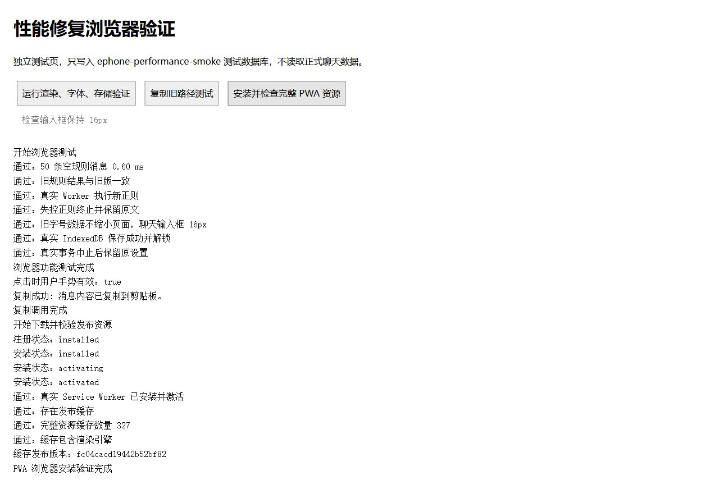

# 性能与移动端修复验证

2026-10-04，代码修复与验证记录。API 400 的请求格式问题不在本次修改范围内。

## 修复结果

| 问题 | 处理方式 | 保留的行为 |
| --- | --- | --- |
| 消息正文无法复制 | 删除 10.2 新增的复制前异步规则处理；复制函数与更新前 `051ef12` 完全一致（统一换行后逐字比较） | 原始正文、特殊消息内容提取、时间戳复制及原有提示 |
| 字号缩小、iOS 输入时放大 | 移除全局及独立聊天字号控件；忽略旧备份中的字号调整，聊天恢复默认 13px，聊天输入框保留原有 16px | 网络字体、本地上传、预览、预设、应用范围、备份兼容；用户自定义 CSS 仍由用户控制 |
| 新字体处理使页面变慢 | 恢复字体继承与少量范围 CSS；取消样式表扫描、节点字号改写和整页 MutationObserver | 字体来源加载、范围切换及恢复默认 |
| 普通消息渲染排队 | 空规则和不适用规则直接返回，旧规则及普通文字规则直接执行；新正则保留 Worker 超时隔离 | 旧规则结果、新规则功能和随机规则逐次执行 |
| 渲染缓存占用过大 | 结果缓存同时限制为最多 300 项、约 2 MiB 字符数据 | 缓存命中行为；该数字不代表整个网页的内存上限 |
| 长聊天保存重复比较全部历史 | 普通保存不扫描；追加消息只比较尾部边界、处理新增尾部 | 删除后重说、采用候选或重建数组时仍保留原日期补录；旧记录不回填为新时间 |
| TimeAwareness.getClockInfo 缺失 | 调用前检查方法是否存在，缺失时使用基础时间路径；相关入口统一处理 | 时间、时区与世界时间功能 |
| 设置一直保存中 | API 配置、全局设置和字体保存接入可中止事务，15 秒超时后解除等待并报告未确认保存 | 成功写入；失败不把字体草稿当成已保存；超时排队的旧写入不会迟到覆盖新设置 |
| PWA 混用新旧资源、更新时清空可用版本 | 构建生成统一发布版本、每个文件的 SHA-256 校验；完整安装后切换；保留一版旧缓存 | 网页与桌面入口使用同套资源；多窗口不强制切换；回复、保存和聊天输入中不刷新 |
| 更新下载同时占用过多资源 | 本地发布资源最多 4 路下载；单文件 20 秒中止；媒体与依赖缓存分开并限制条目数量 | 下载失败保留旧版本与 IndexedDB 数据；本地预览仅清理本应用缓存与作用域 |

## 验证证据

- `npm run build`、`npm run check:structure` 通过，4 个 JS bundle 与 21 个 HTML 片段保持同步。
- `node --test --test-reporter=tap tests/*.test.js`：最终 227 项通过，0 项失败。
- 复制函数与更新前 `051ef12:modules/message-actions.js` 的相应函数完全一致。
- 与存在问题的 10.2 版本 `cc00971` 对照：50 条空规则消息的 Worker 往返由 50 次降为 0 次。更新前旧版的普通聊天同样不需要这些往返。
- 长聊天测试用 100,000 条历史的受限代理阻止遍历：只允许访问尾部边界与新增消息；另测相同长度、缩短历史的重说，以及普通保存不遍历。
- 浏览器独立验证页通过真实 Worker、失控正则终止、16px 输入框、真实 IndexedDB 保存与事务回滚。
- 最终主页面 DOM 检查确认全局和独立聊天字号控件均不存在，聊天输入框实际计算字号为 16px；所有本地脚本只使用同一个发布版本，浏览器错误日志为空。
- 浏览器中完整安装并切换 Service Worker，缓存 327 个发布资源。校验已覆盖项目现有的 UTF-8 BOM 与 CRLF 文件。
- 浏览器中复制调用成功，点击时用户手势有效；测试工具的虚拟剪贴板不能核对系统粘贴结果，手机原生粘贴仍须验收。

浏览器验证页为 `tests/fixtures/performance-smoke.html`。使用独立本地来源测试，只操作 `ephone-performance-smoke` 测试数据库，不读取正式聊天数据。主应用启动进入了现有登录页；没有使用账号或 API 密钥进行远程回复测试。

测试页几轮运行的 50 条空规则消息耗时约 0.3–1.2ms，仅说明这台桌面浏览器中的规则快路径。它不包含完整聊天 DOM、图片、网络或 API，不可当作手机整体性能或与旧版完整体验的比较。

## 真机验收（尚未完成）

必须分别在 iOS Safari 网页、iOS 添加到主屏幕入口、Android 浏览器网页、Android 安装的 PWA 中执行；覆盖受影响的系统版本及至少一台低内存设备。

1. 同一份备份、相同角色、历史、图片和规则，分别打开更新前版本与修复版本；相同网络下分开测冷启动和再次进入，记录进入聊天、首条显示、滚动及连续输入的延迟。
2. 普通正文、语音文字、特殊消息正文与时间戳分别复制，再粘贴到系统备忘录；测试全新加载、切换聊天后、后台返回后。
3. 调出键盘连续输入、收起再调出；确认没有因字体功能缩小输入框而触发自动放大，布局不抖动，发送按钮可用。
4. 网络字体、本地字体、预览、范围恢复、字体预设与旧备份导入均能使用；字号滑块已移除。自定义 CSS 如主动设置小字号，需单独检查。
5. 长聊天多次发送、删除重说、群聊回复、切换聊天和加载旧消息；确认消息、世界日期及原有数据不丢失。
6. 设置保存失败或存储等待时，应结束“保存中”并给出明确结果；网络请求仍能启动。模拟下载中断后重新打开，旧版本应可用。
7. 网页与 PWA 同时打开时不强行切换；只留一个窗口并结束回复、保存后更新，确认切换成功，没有新旧模块混用。检查已缓存依赖下的离线再次启动。
8. 与旧版用相同操作连续运行至少 20 分钟，观察系统是否出现“网页重复出现问题”、重新加载或进程退出。

验收要求：功能效果至少与旧版一致，各项耗时和卡顿不回退；出现崩溃、复制失败或数据异常时不能视为验收通过。目前只有代码、自动测试和桌面浏览器证据，不能据此承诺所有手机绝不闪退。
